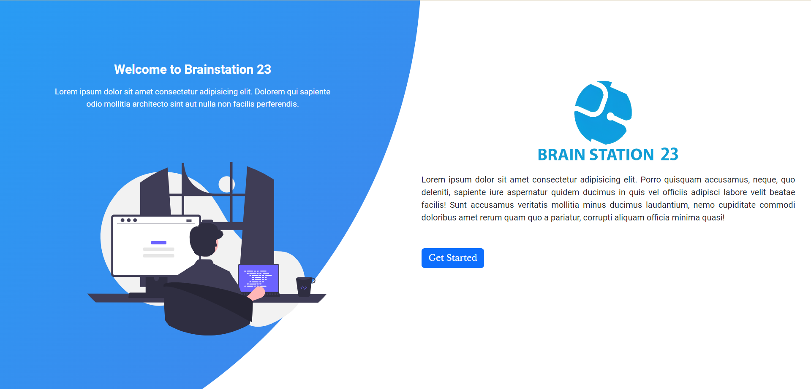
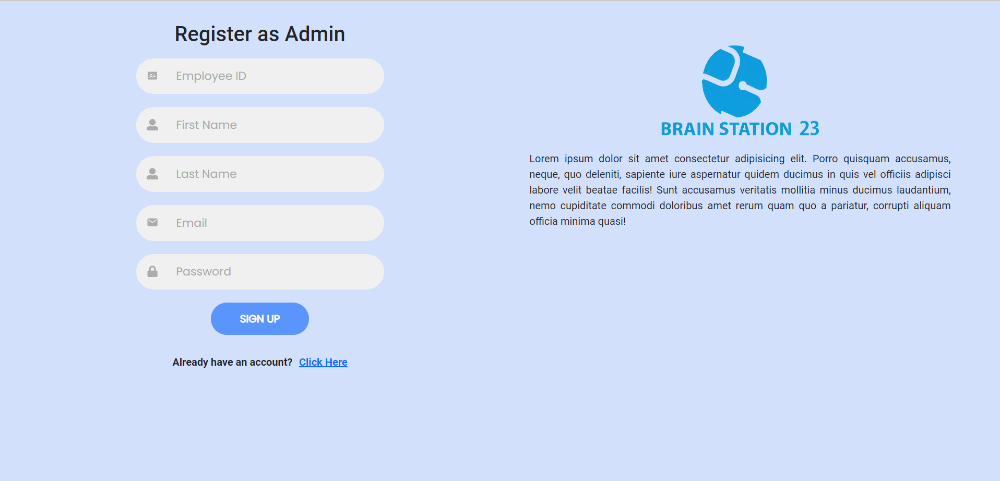
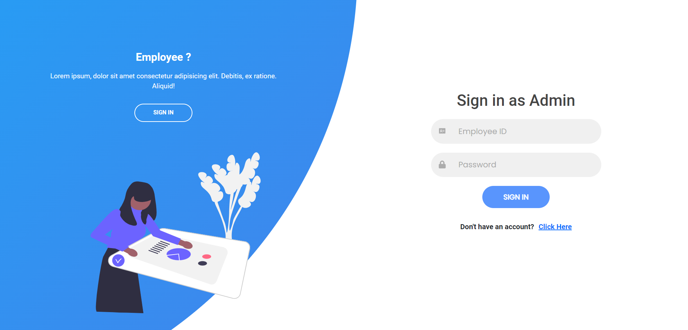
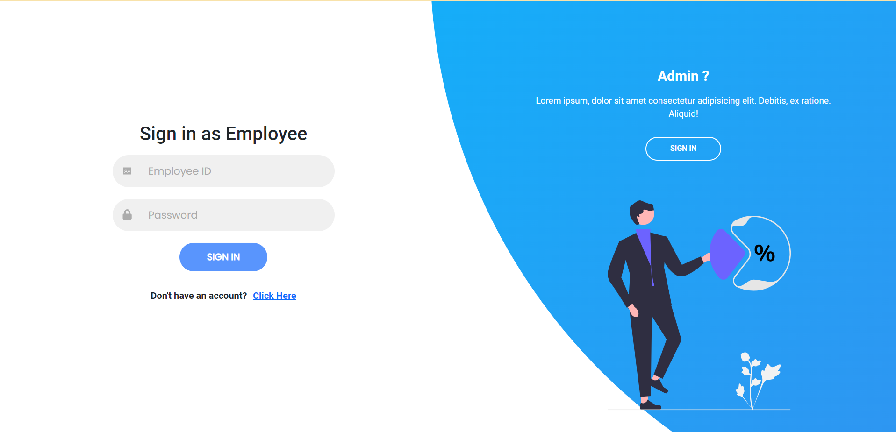
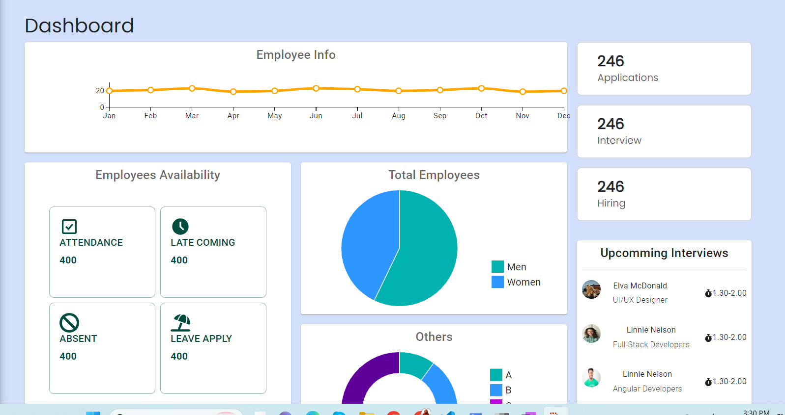
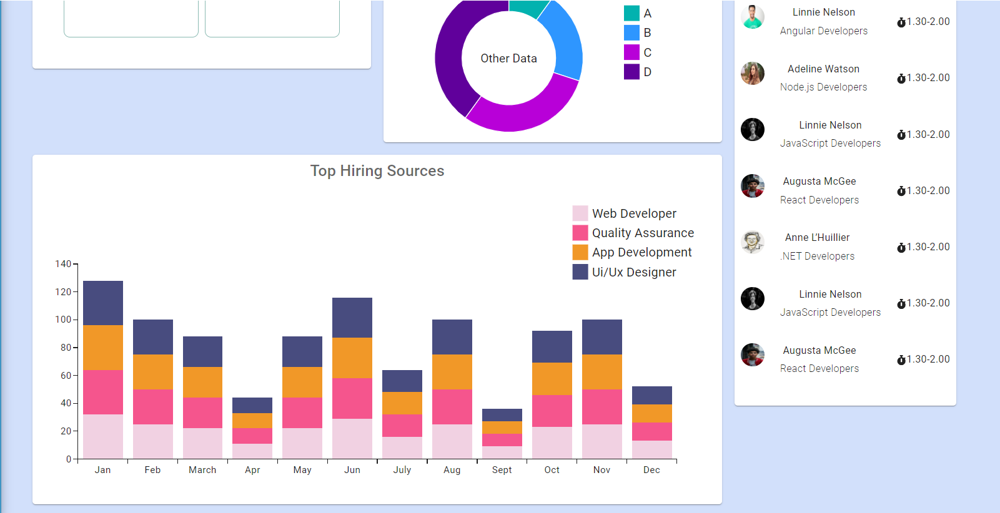
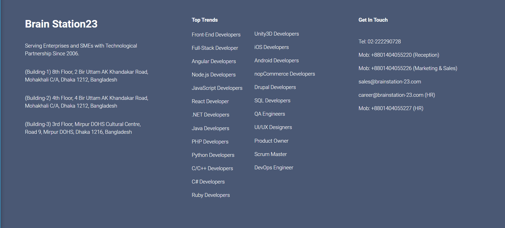
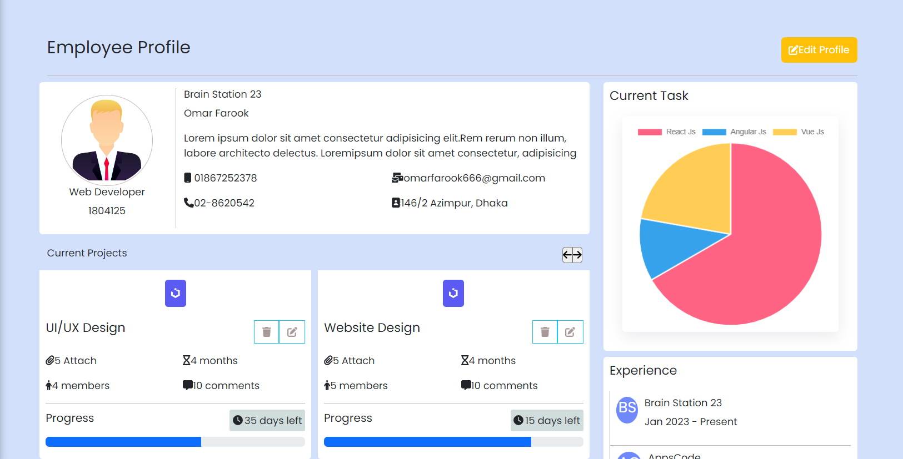
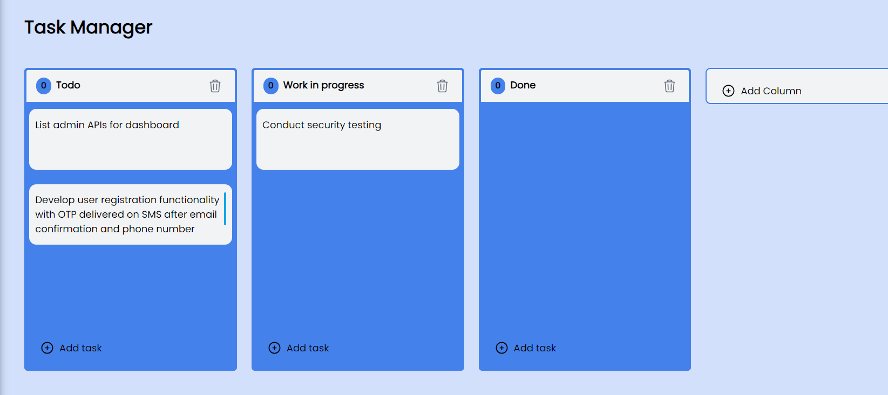

  

 <h1 align="center">Brain Station 23 Employee MAnagement System</h2>
 
An online web application made as a team project using React JS for Industrial Attachment 2023.

  

    
    
    
    
     
  <h3 align="center">Built With</h3>
  <h4 align="center">Frameworks and Dependencies</h4>
  

    
    

    

# Features

- [Signin](#signin)
- [Dashboard](#dashboard)
- [Notifications](#notifications)
- [Sidebar](#sidebar)
- [Calendar](#calendar)
- [Profile](#profile)
- [Edit Profile](#edit-profile)
- [Create Course](#create-course)
- [Publish Result](#publish-result)
- [Attendance](#attendance])
- [Display Result](#display-result)
- [Join Class](#join-class)
- [Class List](#class-list)
- [View Inside Classroom](#view-classroom)
- [Upload Post](#upload-post)
- [Comment](#comment)

## Signin

Students and teachers can login to an already existing account.If they forget their password, a reset password link will be sent to their email.

 

# LANDING PAGE:

# REGISTER AS EMPLOYEE/ADMIN:

# SIGN IN AS ADMIN:

# SIGN IN AS EMPLOYEE

# DASHBOARD-1:

# NAVIGATION BAR

# SIDE NAVIGATION BAR

# FOOTER

# EMPLOYEE LIST:

# ADD EMPLOYEE:

# PROFILE

# PROJECT

